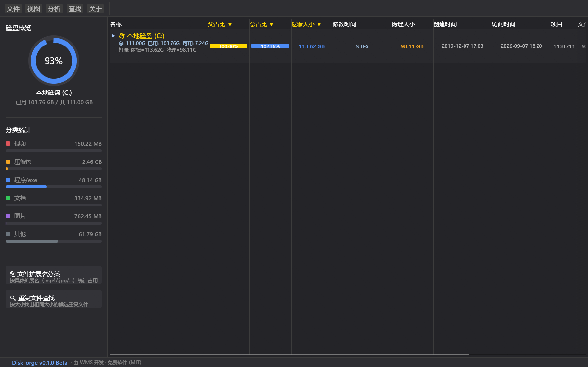

# DiskForge

**免费、单文件、免安装的 Windows 磁盘空间分析器**——一眼看清硬盘空间都被谁吃了。

由 [WMS](mailto:wumingshifn@gmail.com) 开发维护 · 版本 v0.1.0 Beta

## 软件演示视频

[▶ 点击观看 DiskForge 演示视频](docs/demo.mp4)

---

## 这是个什么软件？

硬盘用着用着就满了，但不知道空间到底去哪了？把 DiskForge 双击打开、选中一个盘，
几秒钟后整块硬盘的文件分布就会像上面截图那样摊开在你面前：哪个文件夹最大、
哪批视频/压缩包最占地方、隐藏的系统文件占了多少——全部一目了然。
看清楚之后，直接在软件里就能把不要的东西删掉（走回收站，安全），或者把大文件夹
搬到别的盘并原地留下"传送门"，一点不耽误程序正常使用。

它是一个独立的绿色小工具：**一个 exe 文件，不需要安装，不需要联网，拷到哪用到哪**。
所有分析都在你自己的电脑上完成，不收集、不上传任何数据。

## 功能一览

- **磁盘空间全景**：树形列表展示每个文件夹/文件的大小和占比，彩色比例条按层级配色，
  大块头一眼就能认出来；逻辑大小/物理大小双列（NTFS 压缩、稀疏文件、硬链接都算得明明白白）。
- **极速扫描**：以管理员身份运行时自动启用 NTFS 主文件表直读，几十万到上百万个文件
  的整盘扫描通常只需几秒钟；非管理员模式自动改走常规遍历，慢一点但同样准确。
- **文件扩展名分类**：一键把全盘文件按视频/图片/文档/压缩包/程序等类别统计，
  配合搜索和排序快速定位"哪类东西最占空间"。
- **重复文件查找**：跨盘找出内容完全相同的文件（先按大小/局部指纹筛选，再逐字节比对确认，
  不会误删），支持一键删除整组多余副本或"只留一份、其余替换成符号链接"。
- **文件占用检测**：删不掉、挪不动？查一下是哪个进程/服务正占用着它，
  并且可以直接在结果里结束进程或停止服务。
- **大文件夹瘦身（符号链接迁移）**：把占空间的大文件夹搬到另一个盘，原位置自动创建
  符号链接，系统和软件完全无感——相当于给 C 盘装了个"外挂仓库"。
- **查找与搜索**：`Ctrl+F` 在当前位置定位文件（支持 `*.pid` 这类通配符）；
  搜索页可以对全盘文件名做秒级过滤，支持正则表达式，结果可直接排序、删除、建链接。
- **右键菜单全套操作**：打开资源管理器并定位、删除到回收站、检测占用、创建符号链接、
  重新扫描、按分区分析……
- **CSV 导出**：把扫描结果导出成 Excel 能直接打开的 CSV 表格（带防护，文件名再怪也不会
  被当成公式执行）。
- **人机细节**：显示/隐藏系统元数据文件、多分区排队扫描、操作结果状态条、
  崩溃自动记录诊断日志（方便反馈问题）。

## 快速上手

1. **下载并运行**：拿到 `DiskForge.exe`，双击打开（免安装）。
   想要极速扫描，右键选择"**以管理员身份运行**"（窗口里也有黄色按钮一键重启为管理员）。
2. **选择扫描位置**：启动后弹出选择窗口，勾选一个或多个盘符，也可以手动添加任意文件夹，
   点"开始扫描"。选多个会自动排队，一个扫完接着扫下一个。
3. **看结果**：扫描完成后，主界面按"从大到小"排列所有文件夹和文件。
   点表头可以换排序；点侧边栏的分析按钮进入扩展名分类/重复文件查找；
   `Ctrl+F` 直接查找文件名。
4. **清理空间**：右键任何文件/文件夹——可以删除到回收站、检测被谁占用、
   或创建符号链接把它迁到别的盘。所有删除操作都进回收站，后悔了能恢复。

## 常见问题

**Q：为什么推荐以管理员身份运行？**
A：管理员模式才能启用极速扫描（直读 NTFS 主文件表），普通模式只能一个目录一个目录
慢慢数。两种模式的结果都准确，只是速度差别很大。

**Q：删除文件危险吗？**
A：所有删除都走系统回收站，误删了随时可以还原。"检测占用"和"结束进程/停止服务"
也只在你主动点击时才会执行。

**Q：符号链接迁移是什么原理？会不会影响软件使用？**
A：相当于把文件夹实际搬到新位置，在原来位置留一个"传送门"。对系统和程序来说，
访问原来的路径就等于访问新位置，绝大多数软件完全无感。迁移前软件会自动做
完整性校验和特殊文件检查，遇到不合适的（如系统链接、网盘占位文件）会主动中止并说明。

**Q：首次启动弹出的赞助窗口是什么？**
A：DiskForge 完全免费。如果你觉得它帮到了你，可以通过窗口里的微信/支付宝二维码
请作者喝杯咖啡（金额随意，纯自愿）。首次弹窗会先等几秒再解锁"不再提醒"按钮
（防止一闪而过误点）；点了以后启动就不再弹出，想再看随时点顶部菜单"**关于**"。

**Q：软件出现异常怎么办？**
A：exe 同目录下有一个 `diskforge_log.txt` 诊断日志，记录了每次运行的详细过程
（超过 5MB 自动重开，不会无限变大）。反馈问题时把它一并发给作者即可。

## 赞助支持

DiskForge 是免费软件，开发与维护全凭热情。如果它帮你找回了几十个 G 的空间、
节省了时间，欢迎请作者喝杯咖啡 ☕（金额随意，不强求）。两种收款码都在下面，
软件内点顶部菜单"关于"也能随时打开（微信/支付宝标签页切换）。

| 微信 | 支付宝 |
|:---:|:---:|
|  |  |

- 作者：WMS
- 邮箱：<wumingshifn@gmail.com>

## 版权与许可

版权所有 (C) 2026 WMS

本软件依据 **MIT 许可证** 发布：您可以自由地使用、复制、修改及分发本软件，
但须保留上述版权声明与许可声明。本软件按"现状"提供，不附带任何明示或默示的担保，
包括但不限于对适销性和特定用途适用性的担保。详情见项目中的 [LICENSE](LICENSE) 文件。

## 更新日志

见 [CHANGELOG.md](CHANGELOG.md)。当前版本：**v0.1.0 Beta**（首个公开测试版）。
